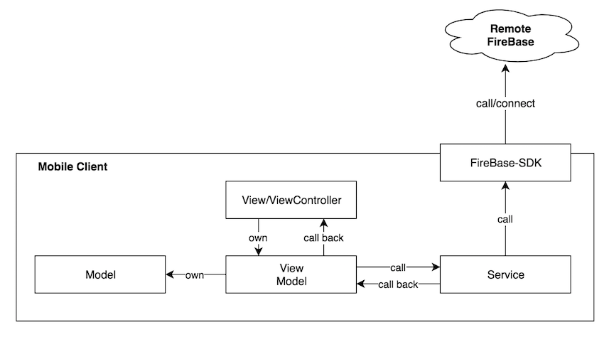
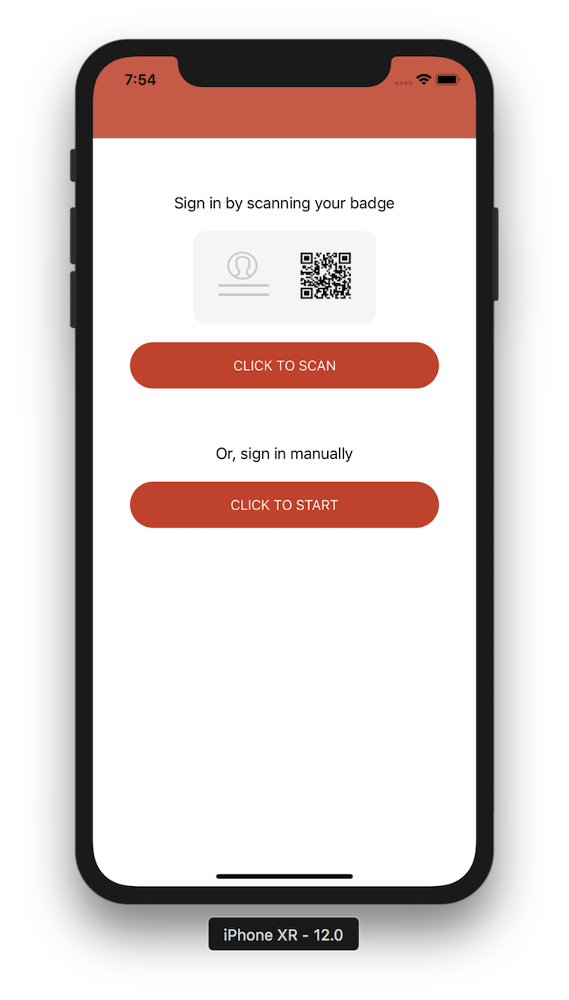
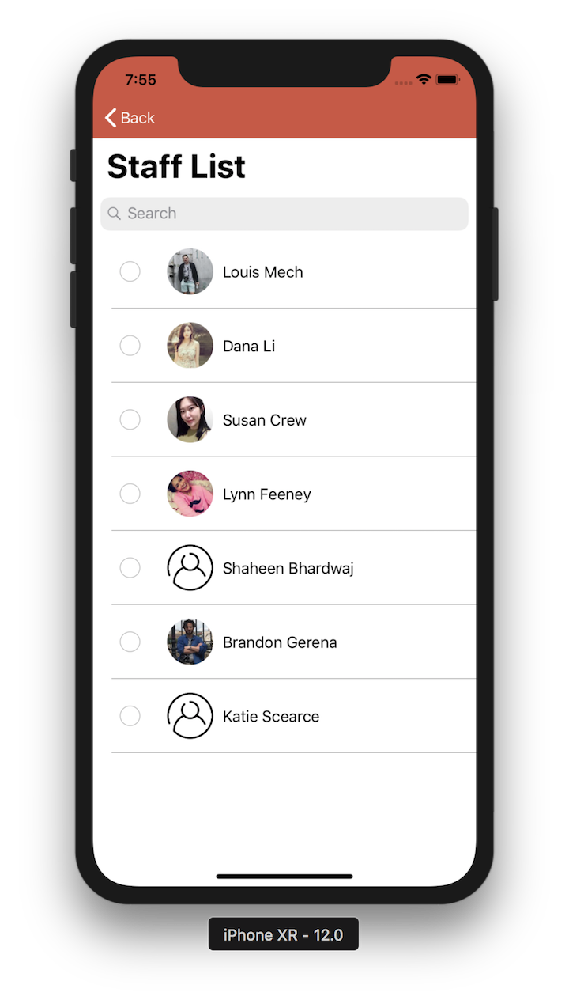
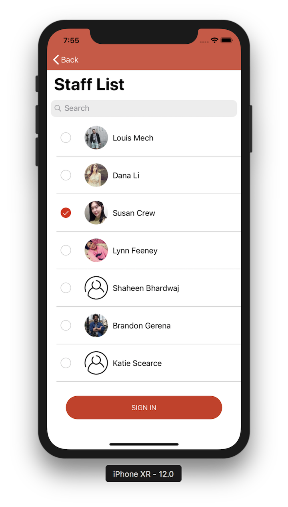
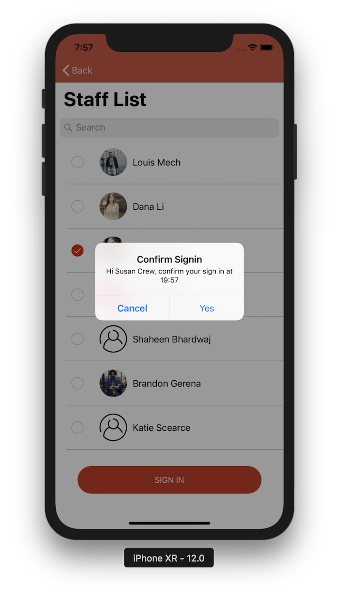
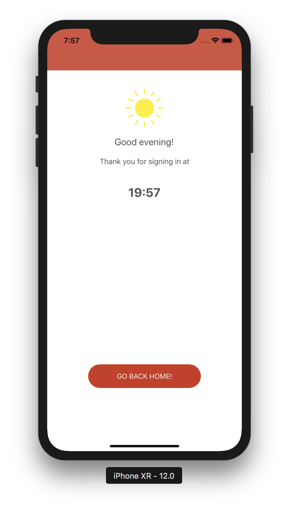

# EmployeeSignIn

### Note
> This is a demo project on iOS showing employee sign-in process.

### Development Environment
> Xcode Version 10.0
>
> Swift 4.2
>
> iOS 11 and above

### Service
> Firebase: https://firebase.google.com

### Architecture


### QR Code design
> QR code on the badge contains staff information in JSON format. Here is an example,


```json
{
"uid": "7hQBpvxTLWRybejxHlCQjDONN1g2",
"email": "test-001@test.com",
"displayName": "Louis Mech",
"photoURL": "https://instagram.fakl2-1.fna.fbcdn.net/vp/56c9894efa681e5d80c63ed4957fa57e/5C5F1459/t51.2885-19/s150x150/38618310_469980173466344_1830012322748301312_n.jpg"
}
```


### Pages





